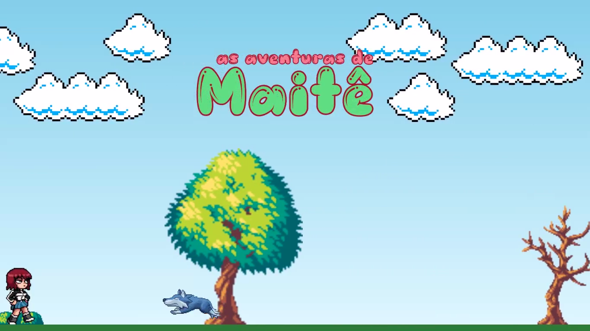

<h1 align="center"> Super Mario Run</h1>

Game desenvolvido utilizando apenas linguagens básicas para prática de aprendizado.

  <a href="#-projeto">Projeto</a>&nbsp;&nbsp;&nbsp;|&nbsp;&nbsp;&nbsp;
  <a href="#-tecnologias">Tecnologias</a>&nbsp;&nbsp;&nbsp;|&nbsp;&nbsp;&nbsp;
  <a href="#-jogar">Jogar</a>

 

  

## 💻 Projeto

Jogo ao estilo T-Rex Game, do Google Chrome, onde o personagem deve desviar dos canos que vêm em sua direção.

## 🚀 Tecnologias

Esse projeto foi desenvolvido com as seguintes tecnologias:

- HTML
- CSS
- JavaScript

## 🎮 Jogar

Clique [aqui](https://aylmerbolzan.github.io/Super-Mario-Run/) para iniciar o jogo.

---
 

Feito com 💛 por [Aylmer Bolzan](https://www.linkedin.com/in/aylmerbolzan/).